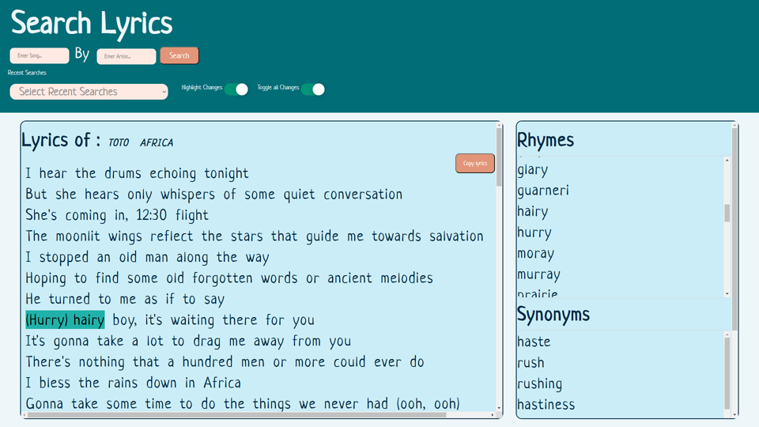

# parody-pumper
Lyric app
Choose a song, change the lyrics that rhyme with another word with word API 

## *User Story*

As a user, I want to get the lyrics to my favourite song, so that I can change the words I don’t like, and copy to clipboard to save somewhere else
- Will be using lyrics.ovh API for a lyric database
- Will be using words API for rhymes, synonyms and antonyms
- Make it into a game by toggling the highlight of what words were changed and what the origional word was with the changed word
- as an option, we may add spotify API to listen to a sample of the song

## *Acceptance Criteria*

```
WHEN I search for a song and artist,
THEN the lyrics will load and display on my screen.

WHEN I hover over the lyrics,
THEN the words are highlighted individually.

WHEN I click on a word,
THEN I am presented with optional rhyming words, synonyms and antonyms.

WHEN I click on one of the options,
THEN the word within the lyrics are changed, and the changes are highlighted.

WHEN I select the COPY button,
THEN the new lyrics are copied to clickboard for me to save elsewhere.

WHEN I want to use this app on a smaller screen or mobile,
THEN the application is responsive.

WHEN I search for a particular song and it is not available,
THEN I am presented with an appropriate response. 

WHEN I come back to the application after exiting,
THEN I have local storage that saves my previous searches.
```
